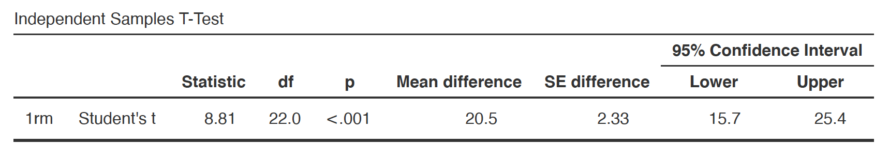

# T-test - er $b_1$ signifikant forskjellig fra null?
En F-test tester om vår alternative modell er en bedre modell enn null-modellen, totalsett. Men det kanskje mest interessante spørsmålet er fremdeles er fremdeles delvis ubesvart: 
* **er b<sub>1</sub> i modellen vår, altså vårt stigningstall som representer den forventede endringen i utfallet for en enhets endring i prediktorvariablen, signifikant forskjellig fra null?**

<div class="info">
Før du leser videre, forsøk å forestill deg hvordan en modell med en b<sub>1</sub> som er 0 ser ut? Deretter se på figurene under


</div>

* Hvis b<sub>1</sub> er 0, er det ingen relasjon mellom disse prediktorvariabelen (x) og utfallsvariabelen (y). 
* Hvis b<sub>1</sub> er > enn 0, er det en positiv relasjon mellom vår prediktovariabel og utfallsvariabelen.
* Hvis b<sub>1</sub> er < enn 0, er det en positiv relasjon mellom vår prediktovariabel og utfallsvariabelen.

Husk at  b<sub>1</sub> i vårt tilfelle representer forskjellene i gjennomsnitt mellom de to gruppene. Det er med andre ord like gyldig å spørre om det er en relasjon mellom variablene som at det er en forskjell i means mellom to grupper.

Vi kan tydelig se at b<sub>1</sub> er forskjellig fra 0 i vårt utvalg, men husk at denne forskjellen kan skyldes sampling variation som vi kan forvente under null-hypotesen. Vi må derfor teste om de to utvalgene vi har kommer fra samme eller to forskjellige populasjoner (en endring som i så fall har skjedd fordi vi har gitt de to utvalgene forskjellig treningsopplegg). Dette kan vi finne ut ved å kjøre en uavhengig t-test.

$$
t.test = \frac{(b_1observert - b_1forventet)}{\text{standard error of } b_1}
$$
Vi vet allerede b<sub>1</sub>observert (den observerte forskjellen mellom de to utvalgene) og b<sub>1</sub>forventet (null-hypotesen er at det ikke er noen relasjon mellom disse variablene, så denne blir null. Så vi kan plotte inn disse verdiene.

$$
t.test = \frac{(20.52 - 0)}{\text{standard error of } b_1}
$$
Det som gjenstår er å finne ut hva standard error of b<sub>1</sub> er. Vi har tidligere regnet ut standard error of mean $SD/sqrt(N)$, og vi kan gjøre noe lignende for å regne ut standard error of b<sub>1</sub>. Men for å fokusere på det store bildet vil jeg gi dere den estimerte standard error of b<sub>1</sub>

<div class="warning">
Prosedyren for å regne ut standard error of b<sub>1</sub> er ikke vanskelig, men det er en del utregningsledd. Så lenge dere forstå at standard error of b1 er et mål på hvor mye utvalg vil være forskjellige fra hverandre, så tenker jeg at dere ikke vil øke deres forståelse ved å lære å regne standard error of b1, men jeg kan selvfølgelig ta feil. Jeg anbefaler dere på det sterkeste at der ser [denne videoen](https://www.youtube.com/watch?v=3L9ZMdzJyyI)

</div>

Fra mitt output i Jamovi kan jeg lese at standard error of b<sub>1</sub> er **2.33**. 



Så jeg kan bruke dette i utregningen av t.

$$
t.test = \frac{(20.52 - 0)}{2.33}
$$

$$
t.test = \frac{(20.52 - 0)}{\text{standard error of } b_1}
$$
$$
t.test = 8.806867
$$
Vår t-verdi er 8.80. Vi kqn se tydelig se at denne t-verdier er større enn den kritiske verdien på ~ 2, så vi kan konkludere at vi har et signifikant funn; ee to utvalgene vi har med i studien synes å komme fra forskjellig populasjon. Vi kan lese denne t-verdien fra output tabellen fra Jamovi at vår p-verdi er < 0.001. 

<div class="warning">
En liten notis som er viktig å være observant på. 

</div>


```{r echo=FALSE, fig.width=6, fig.height=2.5, fig.cap='t-fordelingen og vår t-verdi'}

t.dist <- tibble(
  x = seq(from=-10, to=+10, by=0.1),
  t = dt(x, df = 22)
)

ggplot(t.dist, aes(x, t)) + geom_line() + geom_area(data = subset(t.dist, x < 6), fill = "#00BFC4", alpha=.8) + scale_x_continuous(breaks = seq(-10, 10, by = 1))  + geom_vline(xintercept=0, color="black", linetype = 'dotted') + labs(y="density", x="t") + geom_vline(xintercept=8.2, color="red") + geom_vline(xintercept=2) + geom_vline(xintercept=-2) +
  theme_bw() + labs(title = "T-fordelingen ved vår frihetsgrad (df) på 22",
       x = "t",
       y = "Tetthet")


```


