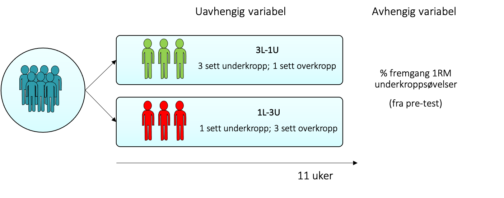

# Datasett {#datasett}

## Bør man trene med ett eller flere sett i styrketrening?
Mange utrente lurer på hvor mange serier de bør gjennnomføre for å oppnå maksimal treningseffekt i styrketrening. Noen føler at de blir slitne etter ett sett og at dette derfor er  tilstrekkelig. Andre mener at et hardere treningstimuli er nødvendig, selv om man er utrent, og at to eller flere sett derfor er bedre. En forsker som var tidlig ute med å undersøke var Bent Rønnestad [@ronnestad_dissimilar_2007]

Eksperimentet ble gjennomført som et **between-subject design** med to grupper:
* en gruppe trente 1 sett på underkroppen og 3 sett på overkroppen
* en annen gruppe trente 3 sett på underkroppen og 1 sett på overkroppen. 

Disse gruppene kalte han henholdsvis **1L-3U** og **3L-1U** (L=lower; U=Upper). 

De to gruppene trente 3 ganger i uken i totalt 11 uker. Forskergruppen ville så se hva som ga mest fremgang i 1RM på underkroppsøvelser. Den avhengige variabelen ble derfor %-fremgang på 1RM på underkroppsøvelser.


Vi har ikke tilgang til dette datasettet, men vi har simulert dette datasettet i R basert på verdiene som ble oppgitt i artikkelen. Datasettet blir tilnærmet likt, men siden det er en simulering blir det aldri helt identisk.  Datasettet ser du i tabellen under.


\begin{table}

\caption{(\#tab:unnamed-chunk-3)Simulert datasett}
\centering
\begin{tabular}[t]{rlr}
\toprule
individ & gruppe & rm\\
\midrule
1 & tre.sett & 40.46704\\
2 & tre.sett & 49.07223\\
3 & tre.sett & 47.94131\\
4 & tre.sett & 44.51389\\
5 & tre.sett & 52.28750\\
\addlinespace
6 & tre.sett & 40.01750\\
7 & tre.sett & 49.48425\\
8 & tre.sett & 29.21048\\
9 & tre.sett & 40.59293\\
10 & tre.sett & 37.58676\\
\addlinespace
11 & tre.sett & 35.42651\\
12 & tre.sett & 42.49354\\
13 & ett.sett & 17.70576\\
14 & ett.sett & 17.07181\\
15 & ett.sett & 18.26811\\
\addlinespace
16 & ett.sett & 25.42594\\
17 & ett.sett & 32.70313\\
18 & ett.sett & 19.10226\\
19 & ett.sett & 22.23827\\
20 & ett.sett & 22.27148\\
\addlinespace
21 & ett.sett & 26.17889\\
22 & ett.sett & 20.34857\\
23 & ett.sett & 23.52773\\
24 & ett.sett & 17.95966\\
\bottomrule
\end{tabular}
\end{table}
Du kan få nøyaktig samme datsett ved å klippe ut og lime inn følgende kode i en skript-fil i R (husk å laste inn tidyverse-pakken, library(tidyverse) ). Du kan også laste ned datasettet som en .csv fil fra canvas.

```r
set.seed(2002) #viktig å ha med denne for å få nøyaktig samme datasett
tre.sett <- round(rnorm(n = 12, mean = 41, sd = 5), 2) #12 individer
ett.sett <- round(rnorm(n = 12, mean = 21, sd = 5), 2) #12 individer

#lager en tibble fra tidyverse-pakken. Må ha lastet inn tidyverse library(tidyverse) i scriptfilen
dat <- tibble(individ = seq(1:24),
              gruppe = rep(c("tre.sett ", "ett.sett"), c(length(tre.sett), length(ett.sett))),
              rm = c(tre.sett , ett.sett))
```

<span style="font-size: 22px; font-weight: bold; color: var(--purple);">Oppgave</span>

Før du går videre er det greit at du gjør deg kjent med datasettet som vi har generert. Studer datasettet og svar på følgende spørsmål:

a) Hvor mange kolonner er det i tabellen over? <input class='solveme nospaces' size='1' data-answer='["3"]'/>
b) Hvor mange deltakere var med i studien? <input class='solveme nospaces' size='2' data-answer='["24"]'/>
c) Hvilke to verdier har variabelen '*gruppe*'? <input class='solveme nospaces' size='5' data-answer='["17.71","17.07","18.27","25.43","32.7","19.1","22.24","22.27","26.18","20.35","23.53","17.96"]'/> og <input class='solveme nospaces' size='5' data-answer='["40.47","49.07","47.94","44.51","52.29","40.02","49.48","29.21","40.59","37.59","35.43","42.49"]'/>


## Gjennomsnitt for de to gruppene
Bra! Det er alltid viktig å bli kjent med sitt eget datasett, men nå som du har det kan vi gå videre. Vi er interessert i om det er forskjeller mellom de to gruppene ("tre.sett" vs. ett.sett) på % fremgang fra pre- til post-test. Så kanskje vi kan starte med å se om det er forskjeller i gjennomsnitt mellom to gruppene? Dette kan enkelt gjøres i R, Jamovi eller excel. Her er en kode for å løse dette i R:


```r
#jeg lager et oobjekt som heter mean_rm 
mean_rm <- dat %>%
  #Jeg grupperer etter gruppe, slik at jeg får et mean for hver gruppe istf. for å få mean for alle individene
  #group_by er en funksjon for dette
  group_by(gruppe) %>%
  #deretter bruker jeg summarise funksjonen for å regne gjennomsnitt
  summarise(mean.fremgang.1RM = mean(rm))
```
Koden gir oss følgende tabell:
\begin{table}

\caption{(\#tab:unnamed-chunk-6)Gjennomsnittlige %-vis fremgang for de to gruppene}
\centering
\begin{tabular}[t]{lr}
\toprule
gruppe & mean.fremgang.1RM\\
\midrule
ett.sett & 21.90083\\
tre.sett & 42.42417\\
\bottomrule
\end{tabular}
\end{table}

<span style="font-size: 22px; font-weight: bold; color: var(--purple);">Oppgave</span>

d) Hvilken gruppe hadde mest fremgang?
<select class='solveme' data-answer='["tre.sett"]'> <option></option> <option>ett.sett</option> <option>tre.sett</option></select>`

## Figur av datasettet
Vi kan også presentere dataen i en figur. For denne typen data er det veldig vanlig å bruke et **stolpediagram**:

\begin{figure}

{\centering \includegraphics[width=0.6\linewidth]{02-datasett_files/figure-latex/unnamed-chunk-7-1} 

}

\caption{Modeller med forskjellig b1}(\#fig:unnamed-chunk-7)
\end{figure}
Et stolpediagram er pent å se på, men er egentlig designet for å kategoriske data. For eksempel er det fint å bruke dette når vi skal presentere frekvensen antall som har kjørt bil til skolen og antall personer som har gått. Les [@weissgerber_beyond_2015](https://journals.plos.org/plosbiology/article?id=10.1371/journal.pbio.1002128). Deretter svar på følgende spørsmål for å se om du har forstått problemene ved å bruke stolpediagram på kontinuerlig data.

<span style="font-size: 22px; font-weight: bold; color: var(--purple);">Oppgave</span>

b. Hva får du hvis du summerer  all erroren for alle indidene?  <select class='solveme' data-answer='["null","0"]'> <option></option> <option>null</option> <option>0</option> <option>3</option> <option>-3</option></select>. 

e. Stolpediagram er designet for <select class='solveme' data-answer='["kategorisk"]'> <option></option> <option>kontinuerlig</option> <option>kategorisk</option></select> data. 

f. Høyden på stolpen representerer <input class='solveme nospaces' size='14' data-answer='["gjennomsnittet"]'/> (bruk det norske begrepet!), hvilket vil si at det også må ligge noen observasjoner over og under stolpen.

g. Et stolpediagram viser ikke <select class='solveme' data-answer='["fordelingen av observasjonene"]'> <option></option> <option>standard error</option> <option>standardavvik</option> <option>CI</option> <option>fordelingen av observasjonene</option></select>, og dette spesielt være problematisk ved <select class='solveme' data-answer='["små"]'> <option></option> <option>store</option> <option>små</option></select>. 

h. Forfatterne av artikkelen anbefaler mer bruk av <select class='solveme' data-answer='["scatterplot"]'> <option></option> <option>bar graph</option> <option>scatterplot</option></select> for kontinuerlige variabler.

i. Er standard error og standardavvik det samme? <select class='solveme' data-answer='["nei"]'> <option></option> <option>ja</option> <option>nei</option></select>.
