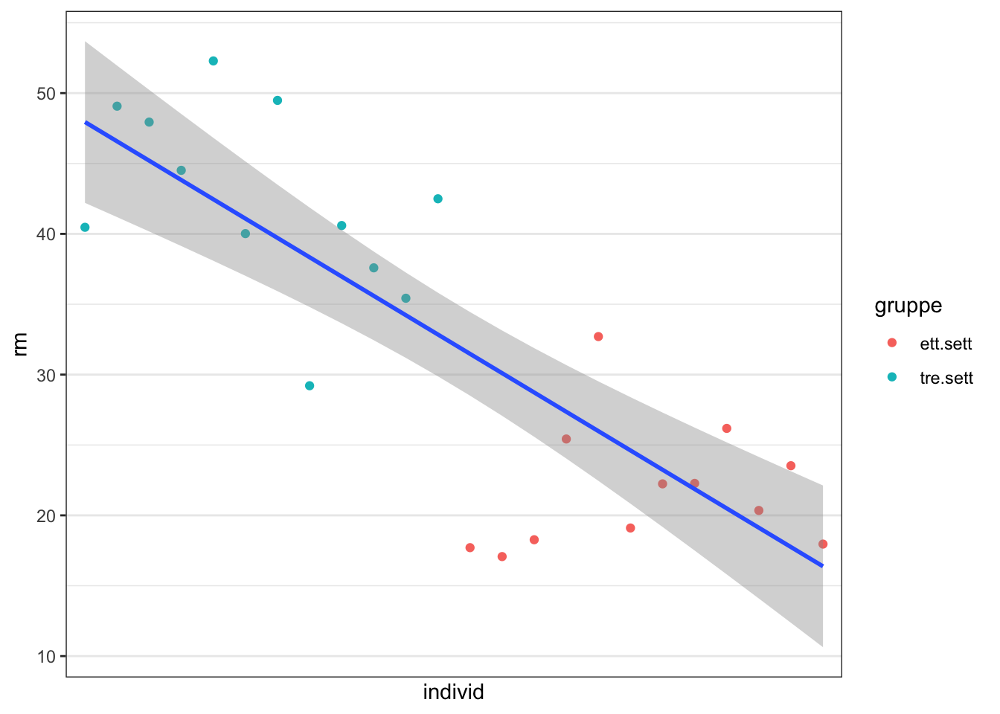

# H1: Alternativ hypotese

I forrige avsnitt redegjorde vi for at **null-hypotesen (H0)** er en ligning som består av kun en, som var gjennomsnittet for alle deltakerne i studien (uavhengig gruppe). 

$$
data = (modell) + error
$$ 
$$
Yi = b0 + error
$$ 
$$
 = mean + error
$$ 
$$
1RM = mean + error
$$ 
Det vi skal gjøre nå er å spørre oss nå er om det er behov for å legge til en ekstra prediktorvariabel i modellen eller om det er nok å beholde den ene prediktorvariabelen? Så det vi skal spørre oss om nå er

$$
 = mean + error
$$ 
En annen måte å si dette på er om det er forskjeller mellom de to gruppene eller om det ikke er det. Hvis det ikke er noen forskjeller mellom gruppene, så vil b1 være liten, og vil egentlig bare ende opp med samme prediksjon uansett hvilken gruppe de har tilhørt. Jeg har nå regnet ut hva verdiene i modellen er, så vi få et inntrykk av hvordan modellen virker før vi finner ut hvordan vi regner disse verdiene. Når jeg har brukt dummykoding har jeg fått følgende verdier i min modell:

$$
%1RM = b0 + b1 + error
$$

$$
%1RM = 21.90  + b1(20.52*gruppe) + error
$$

Husk at gruppen vår er dummykodet som 0 og 1. Så hvis jeg har å gjøre med et individ som tilhører gruppe 0, så blir resultatet følgende

$$
%1RM = 21.90  + b1(20.52*0) + error
$$

$$
%1RM = 21.90 + error
$$
20.52*0 = 0, så vår prediksjon av et individ som tihører gruppe 0 blir da kun 21.90. Hvis vi har en person tilhørte gruppe 1, så blir vår prediksjon 

$$
%1RM = 21.90 + b1(20.52*1) error
$$
Som blir 42.42. Hva er spesielt med disse verdiene? Gå tilbake til. 


```r
library(tidyverse)
```


```r
set.seed(2002) #viktig å ha med denne for å få nøyaktig samme datasett
tre.sett <- rnorm(n = 12, mean = 41, sd = 5) #12 individer
ett.sett <-rnorm(n = 12, mean = 21, sd = 5) #12 individer

#lager en tibble fra tidyverse-pakken. Må ha lastet inn tidyverse library(tidyverse) i scriptfilen
dat <- tibble(individ = seq(1:24),
              gruppe = rep(c("tre.sett ", "ett.sett"), c(length(tre.sett), length(ett.sett))),
              rm = c(tre.sett , ett.sett))


#lager et nytt objekt som heter dummykodet.dat
dat <- dat %>%
  # her lager jeg en ny kolonne som heter dummykoder. If gruppe == 'ett.sett', gi verdien 0, else gi de 1.
  mutate(dummykodet = if_else(gruppe == "ett.sett", 0, 1)
  )


dat <- dat %>%
  # her lager jeg en ny kolonne som heter dummykoder. If gruppe == 'ett.sett', gi verdien 0, else gi de 1.
  mutate(kontrast = if_else(gruppe == "ett.sett", -0.5, 0.5)
  )

dat <- dat %>%
  mutate(dummykodet = as.factor(dummykodet),
         kontrast = as.factor(kontrast))
```


```r
lm(rm ~ dummykodet, dat)
```

```
## 
## Call:
## lm(formula = rm ~ dummykodet, data = dat)
## 
## Coefficients:
## (Intercept)  dummykodet1  
##       21.90        20.52
```

```r
library(tidyverse)


ggplot(dat, aes(y=rm, x=individ)) + 
  geom_point(aes(colour=gruppe)) +
  geom_smooth(method="lm", formula=y~x) +
  
  scale_x_discrete()
```

<div class="figure" style="text-align: center">

<p class="caption">(\#fig:unnamed-chunk-4)**CAPTION THIS FIGURE!!**</p>
</div>

Her fikk jeg en intercept på 21.90 og en slope på 20.52. La oss prøve å få disse to til. 

$$
Y = b0 + b1 + error
$$
$$
Y = b0 + (b1*0) + error
$$

$$
$$
Y = b0 + (b1*1) + error
$$


